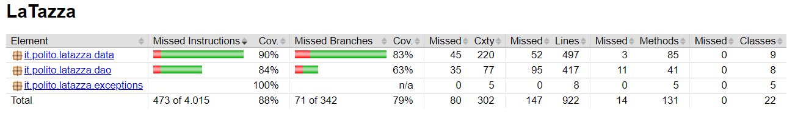

# Unit Testing Documentation template

Authors: Antonio Santoro, Rinaldo Clemente, Giovanni Camarda, Marco Testa

Date: 08/06/2019

Version: 5.0

# Contents

- [Black Box Unit Tests](#black-box-unit-tests)

- [White Box Unit Tests](#white-box-unit-tests)

# Black Box Unit Tests

### **Class *LaTazzaAccountDAO* - method *read***

**Criteria for method *read*:**
	

 - Return value
 - LaTazzaAccount table instance

**Predicates for method *read*:**

| Criteria | Predicate |
| -------- | --------- |
| Return value | null |
|              | not null |
| LaTazzaAccount table instance | created |
|                               | not created |

**Boundaries**:

| Criteria | Boundary values |
| -------- | --------------- |
|  |  |

**Combination of predicates**:

| Return value | LaTazzaAccount table instance | Valid / Invalid | Description of the test case | JUnit test case |
|-------|-------|-------|-------|------|
| null | created | V | LaTazzaAccountDAO.read() -> null|LaTazzaAccountDAOTest.readTC1()|
|       | not created | I | LaTazzaAccountDAO.read() -> SQLException | LaTazzaAccountDAOTest.readTC2() |
| not null | created | I | LaTazzaAccountDAO.read() -> not null|LaTazzaAccountDAOTest.readTC3()|
|           | not created | I | LaTazzaAccountDAO.read() -> SQLException | LaTazzaAccountDAOTest.readTC4() |

### **Class *LaTazzaAccountDAO* - method *write***

**Criteria for method *write*:**
	

 - Return value
 - Value of laTazzaAccount

**Predicates for method *write*:**

| Criteria | Predicate |
| -------- | --------- |
| Return value  | !=1 |
|               | 1 |
|Value of laTazzaAccount| null|
|                       | not null|

**Boundaries**:

| Criteria | Boundary values |
| -------- | --------------- |
|   |  |

**Combination of predicates**:

| Return value | Value of laTazzaAccount |Valid / Invalid | Description of the test case | JUnit test case |
|-----|-----|------|-----|-----|
| !=1 | null | I | LaTazzaAccountDAO.write(null) -> throws SQLException | LaTazzaAccountDAOTest.writeTC1() |
|   | not null | I | LaTazzaAccountDAO.write(laTazzaAccount) -> throws SQLException | LaTazzaAccountDAOTest.writeTC4() |
| 1 | null | I | LaTazzaAccountDAO.write(null) -> throws SQLException | LaTazzaAccountDAOTest.writeTC3() |
|   | not null | V | LaTazzaAccountDAO.write(laTazzaAccount) -> 1 | LaTazzaAccountDAOTest.writeTC2() |

### **Class *LaTazzaAccountDAO* - method *update***

**Criteria for method *update*:**
	

 - Number of updated tuples
 - Value of laTazzaAccount

**Predicates for method *update*:**

| Criteria | Predicate |
| -------- | --------- |
| Number of updated tuples        | 0          |
|          | 1  |
|Value of laTazzaAccount| null|
|  | not null|

**Boundaries**:

| Criteria | Boundary values |
| -------- | --------------- |
| Number of updated tuples        | 0, 1|

**Combination of predicates**:

| Number of updated tuples | Value of laTazzaAccount | Valid / Invalid | Description of the test case | JUnit test case |
|-----|-----|------|-----|-----|
| 0 | null | I | LaTazzaAccountDAO.update(null) -> throws SQLException | LaTazzaAccountDAOTest.updateTC2() |
|   | not null | I | LaTazzaAccountDAO.update(laTazzaAccount) -> throws SQLException | LaTazzaAccountDAOTest.updateTC1() |
| 1 | null | I | LaTazzaAccountDAO.update(null) -> throws SQLException | LaTazzaAccountDAOTest.updateTC2() |
|   | not null | V | LaTazzaAccountDAO.update(laTazzaAccount) -> 1 | LaTazzaAccountDAOTest.updateTC4() |

### **Class *LaTazzaAccountDAO* - method *delete***

**Criteria for method *delete*:**
	

 - LaTazzaAccount instance

**Predicates for method *delete*:**

| Criteria | Predicate |
| -------- | --------- |
| LaTazzaAccount instance | null |
|          | not null |

**Boundaries**:

| Criteria | Boundary values |
| -------- | --------------- |
| | |

**Combination of predicates**:

| LaTazzaAccount instance | Valid / Invalid | Description of the test case | JUnit test case |
|-------|-------|-------|-------|
| null |V|LaTazzaAccountDAO.delete() -> throws SQLException|LaTazzaAccountDAOTest.deleteTC1()|
| not null |I|LaTazzaAccountDAO.delete()  LaTazzaAccountDAO.read() -> null|LaTazzaAccountDAOTest.deleteTC2() |

###### NOTE: all the above test cases are applicable to all DAO classes so the fixes made for the LaTazzaAccountDAO have been done for all the other DAO ones

### **Class *DataImpl* - method *buyBoxes***

**Criteria for method *buyBoxes*:**
	
 - Value of beverageId
 - Value of boxQuantity
 - Price variation

**Predicates for method *buyBoxes*:**

| Criteria | Predicate |
| -------- | --------- |
| Value of beverageId | >0 |
|                       | <=0 |
|                       | null |
| Value of boxQuantity | boxQuantity*boxPrice > cashAccountBalance |
|                       | boxQuantity*boxPrice <= cashAccountBalance |
|                       | 0 |
| Price variation | yes |
|                   | no |

**Boundaries**:

| Criteria | Boundary values |
| -------- | --------------- |
| Value of beverageId | MIN_VALUE, 0, MAX_VALUE |
| Value of boxQuantity | MIN_VALUE, 0, MAX_VALUE |

**Combination of predicates**:

| Value of beverageId | Price variation | Value of boxQuantity | Valid / Invalid | Description of the test case | JUnit test case |
|-------|-------|-------|-------|-------|------|
| >0 | no | boxQuantity*boxPrice <= cashAccountBalance | V | buyBoxes(1,2)  new_cashAccountBalance = old_cashAccountBalance - boxQuantity\*old_boxPrice  new_numCapsulesAvailable = old_numCapsulesAvailable + boxQuantity*numCapsulesPerBox | TestDataImpl.buyBoxesTC1() |
|    |    | boxQuantity*boxPrice > cashAccountBalance | I | buyBoxes(1,2) -> throws NotEnoughBalance | TestDataImpl.buyBoxesTC2() |
|    |    | 0                                         | V | buyBoxes(1,0)  new_cashAccountBalance = old_cashAccountBalance | TestDataImpl.buyBoxesTC4() |
|    | yes | boxQuantity*boxPrice <= cashAccountBalance | V | buyBoxes(1,2)  new_cashAccountBalance = old_cashAccountBalance - boxQuantity\*new_boxPrice  new_numCapsulesAvailable = old_numCapsulesAvailable + boxQuantity*numCapsulesPerBox | TestDataImpl.buyBoxesTC1() |
|    |    | boxQuantity*boxPrice > cashAccountBalance | I | buyBoxes(1,10) -> throws NotEnoughBalance | TestDataImpl.buyBoxesTC2() |
|    |    | 0                                         | V | buyBoxes(1,0)  new_cashAccountBalance = old_cashAccountBalance | TestDataImpl.buyBoxesTC4() |
| <=0 | no | boxQuantity*boxPrice <= cashAccountBalance | I | buyBoxes(-1,2) -> throws BeverageException | TestDataImpl.buyBoxesTC3() |
|    |    | boxQuantity*boxPrice > cashAccountBalance | I | buyBoxes(-1,10) -> throws BeverageException | TestDataImpl.buyBoxesTC3() |
|    |    | 0                                         | I | buyBoxes(-1,0) -> throws BeverageException | TestDataImpl.buyBoxesTC3() |
|    | yes | boxQuantity*boxPrice <= cashAccountBalance | I | buyBoxes(-1,2) -> throws BeverageException | TestDataImpl.buyBoxesTC3() |
|    |    | boxQuantity*boxPrice > cashAccountBalance | I | buyBoxes(-1,10) -> throws BeverageException | TestDataImpl.buyBoxesTC3() |
|    |    | 0                                         | I | buyBoxes(-1,0) -> throws BeverageException | TestDataImpl.buyBoxesTC3() |
| null | no | boxQuantity*boxPrice <= cashAccountBalance | I | buyBoxes(null,2) -> throws BeverageException | TestDataImpl.buyBoxesTC3() |
|    |    | boxQuantity*boxPrice > cashAccountBalance | I | buyBoxes(null,10) -> throws BeverageException | TestDataImpl.buyBoxesTC3() |
|    |    | 0                                         | I | buyBoxes(null,0) -> throws BeverageException | TestDataImpl.buyBoxesTC3() |
|    | yes | boxQuantity*boxPrice <= cashAccountBalance | I | buyBoxes(null,2) -> throws BeverageException | TestDataImpl.buyBoxesTC3() |
|    |    | boxQuantity*boxPrice > cashAccountBalance | I | buyBoxes(null,10) -> throws BeverageException | TestDataImpl.buyBoxesTC3() |
|    |    | 0                                         | I | buyBoxes(null,0) -> throws BeverageException | TestDataImpl.buyBoxesTC3() |

### **Class *DataImpl* - method *sellCapsules***

**Criteria for method *sellCapsules*:**
	
 - Sign of beverageId
 - Sign of employeeId
 - Value of capsules 
 - From account value
 - Price variation

**Predicates for method *sellCapsules*:**

| Criteria | Predicate |
| -------- | --------- |
| Sign of employeeId | positive |
|                       | negative |
|                       | null |
| Sign of beverageId | positive |
|                       | negative |
|                       | null |
| Value of capsules | capsules > capsuleType.getQuantity |
|                       | capsules <= capsuleType.getQuantity |
| From account value | true |
|                       | false |
| Price variation | true |
|                       | false |

**Boundaries**:

| Criteria | Boundary values |
| -------- | --------------- |
| Value of capsules | 0, MAX_VALUE |

**Combination of predicates**:

| Sign of employeeId | Sign of beverageId | Value of capsules | From account value | Price variation |Valid / Invalid | Description of the test case | JUnit test case |
|-------|-------|-------|-------|-------|-------|-------|-------|
| positive | positive | capsules < capsuleType.gettotQuantity| true | false | | V | sellCapsules(1,1, 10, true )  PersonalAccount.balance_new = PersonalAccount.balance_old-capsules*price | TestDataImpl.sellCapsulesTC1() |
|          | positive | capsules > capsuleType.gettotQuantity| true | false | I | sellCapsules(1,1, 30, true ) -> throws NotEnoughCapsules  | TestDataImpl.sellCapsulesTC2() |
| positive | negative | capsules > capsuleType.gettotQuantity| true | false | I | sellCapsules(1,-1, 30, true ) -> throws BeverageException | TestDataImpl.sellCapsulesTC3() |
| negative | positive | capsules < capsuleType.gettotQuantity| true | false | I | sellCapsules(-1,1, 10, true ) -> throws EmployeeException | TestDataImpl.sellCapsulesTC4() |
| positive | positive | capsules < capsuleType.gettotQuantity| false | false | V | sellCapsules(1,1, 10, false )  personalAccount not updated, | TestDataImpl.sellCapsulesTC5() |
| null | positive | capsules < capsuleType.gettotQuantity| true | false | I | sellCapsules(null,1, 10, true ) -> throws EmployeeException | TestDataImpl.sellCapsulesTC6() |
| positive | null | capsules < capsuleType.gettotQuantity| true | false | I | sellCapsules(1,null, 10, true ) -> throws BeverageException | TestDataImpl.sellCapsulesTC7() |
| positive | positive | capsules < (capsuleType.getOldQuantity + capsuleType.getNewQuantity) | true | true | V | 2x sellCapsules(1,1, 25, true )  PersonalAccount.balance_new = PersonalAccount.balance_-(oldcapsules*oldprice + newcapsule*newprice) | TestDataImpl.sellCapsulesTC8() |

### **Class *DataImpl* - method *sellCapsulesToVisitor***

**Criteria for method *sellCapsules*:**
	
 - Sign of beverageId
 - Value of capsules 
 - Price variation

**Predicates for method *sellCapsules*:**

| Criteria | Predicate |
| -------- | --------- |
| Sign of beverageId | positive |
|                       | negative |
|                       | null      |
| Value of capsules | capsules > capsuleType.getQuantity |
|                       | capsules <= capsuleType.getQuantity |
| Price variation | true|
|                   |   false|

**Boundaries**:

| Criteria | Boundary values |
| -------- | --------------- |
| Value of capsules | 0, MAX_VALUE |

**Combination of predicates**:

| Sign of beverageId |   Price Variation   | Value of capsules | Valid / Invalid | Description of the test case | JUnit test case |
|-------|-------|-------|-------|-------|-------|
| positive |false| capsules < capsuleType.getQuantity | V | sellCapsulesToVisitor(1,10)  LaTazzaAccount.balance_new = LaTazzaAccount.balance_old+capsules*price | TestDataImpl.sellCapsulesToVisitorTC1() |
| positive |false| capsules > capsuleType.getQuantity | I | sellCapsulesToVisitor(1,20) -> throws NotEnoughCapsules  | TestDataImpl.sellCapsulesToVisitorTC2() |
| negative |false| capsules > capsuleType.getQuantity | I | sellCapsulesToVisitor(-1,10) -> throws BeverageException | TestDataImpl.sellCapsulesToVisitorTC3() |
| negative |false| capsules < capsuleType.getQuantity | I | sellCapsulesToVisitor(-1,20) -> throws BeverageException | TestDataImpl.sellCapsulesToVisitorTC4() |
| null     |false| capsules > capsuleType.getQuantity | I | sellCapsulesToVisitor(null,10) -> throws BeverageException | TestDataImpl.sellCapsulesToVisitorTC5() |
| null     |false| capsules < capsuleType.getQuantity | I | sellCapsulesToVisitor(null,20) -> throws BeverageException | TestDataImpl.sellCapsulesToVisitorTC6() |
| positive |true| capsules < capsuleType.getQuantity | V | sellCapsulesToVisitor(1,10)  LaTazzaAccount.balance_new = LaTazzaAccount.balance_old+capsules*price | TestDataImpl.sellCapsulesToVisitorTC1() |
| positive |true| capsules > capsuleType.getQuantity | I | sellCapsulesToVisitor(1,20) -> throws NotEnoughCapsules  | TestDataImpl.sellCapsulesToVisitorTC2() |
| negative |true| capsules > capsuleType.getQuantity | I | sellCapsulesToVisitor(-1,10) -> throws BeverageException | TestDataImpl.sellCapsulesToVisitorTC3() |
| negative |true| capsules < capsuleType.getQuantity | I | sellCapsulesToVisitor(-1,20) -> throws BeverageException | TestDataImpl.sellCapsulesToVisitorTC4() |
| null     |true| capsules > capsuleType.getQuantity | I | sellCapsulesToVisitor(null,10) -> throws BeverageException | TestDataImpl.sellCapsulesToVisitorTC5() |
| null     |true| capsules < capsuleType.getQuantity | I | sellCapsulesToVisitor(null,20) -> throws BeverageException | TestDataImpl.sellCapsulesToVisitorTC6() |

### **Class *DataImpl* - method *getReport***

**Criteria for method *getReport*:**
	
 - Value of startDate
 - Input parameters

**Predicates for method *getReport*:**

| Criteria | Predicate |
| -------- | --------- |
| Value of startDate | <= endDate |
|                       | > endDate |
| Input parameters | not null |
|                   | null |

**Boundaries**:

| Criteria | Boundary values |
| -------- | --------------- |
|  |  |

**Combination of predicates**:

Value of startDate | Input parameters | Valid / Invalid | Description of the test case | JUnit test case |
|-------|-------|-------|-------|-------|
| <= endDate | not null | V | bId = createBeverage(coffee,100,10)  eId = createEmployee(antonio,santoro)  rechargeAccount(eId, 1000)  buyBoxes(bId, 1)  sellCapsules(eId, bId, 1, false)  sellCapsules(eId, bId, 1, true)  sellCapsulesToVisitor(bId, 1)  getReport(today,tomorrow) ->  "datetime RECHARGE antonio santoro 10€"  "datetime BUY coffee 1"  "datetime CASH antonio santoro coffee 1"  "datetime BALANCE antonio santoro coffee 1"  "datetime VISITOR coffee 1"  getReport(today,tomorrow).size() == 5 | TestDataImpl.getReportTC1() |
|            | null | I | ...  getReport(null,tomorrow) -> throws DateException  getReport(today,null) -> throws DateException | TestDataImpl.getReportTC2() |
| > endDate | not null | I | ...  getReport(tomorrow,today) -> throws DateException | TestDataImpl.getReportTC2() |
|           | null | I | ...  getReport(tomorrow,null) -> throws DateException  getReport(null,today) -> throws DateException | TestDataImpl.getReportTC2() |

### **Class *DataImpl* - method *createBeverage***
**Criteria for method *createBeverage*:**
	
 - Input parameters

**Predicates for method *createBeverage*:**

| Criteria | Predicate |
| -------- | --------- |
| Input parameters | valid |
|                  | not valid |

**Boundaries**:

| Criteria | Boundary values |
| -------- | --------------- |
|  |  |

**Combination of predicates**:

| Input parameters | Valid / Invalid | Description of the test case | JUnit test case |
|-------|-------|-------|-------|
| valid | V | id1 = createBeverage(coffee,100,10)  id2 = createBeverage(the,100,20)  id1 != id2  coffee = getBeverageName(id1)  the = getBeverageName(id2)  100 = getCapsulesPerBox(id1)  100 = getCapsulesPerBox(id2)  10 = getBoxPrice(id1)  20 = getBoxPrice(id2) | TestDataImpl.createBeverageTC1() |
| not valid | I | createBeverage(null,100,10) -> throws BeverageException  createBeverage(coffee,null,10) -> throws BeverageException  createBeverage(coffee,100,null) -> throws BeverageException  createBeverage(coffee,-1,10) -> throws BeverageException  createBeverage(coffee,100,-1) -> throws BeverageException  createBeverage(  ,100,10) -> throws BeverageException  | TestDataImpl.createBeverageTC2() |

### **Class *DataImpl* - method *rechargeAccount***
**Criteria for method *rechargeAccount*:**
	
 - Sign of EmployeeId
 - Value of amountInCents

**Predicates for method *rechargeAccount*:**

| Criteria | Predicate |
| -------- | --------- |
| Sign of EmployeeId | positive |
|                       | negative |
|                       | null |

**Boundaries**:

| Criteria | Boundary values |
| -------- | --------------- |
| EmployeeId | 0, MAX_VALUE |

**Combination of predicates**:

| Sign of EmployeeId | Valid / Invalid | Description of the test case | JUnit test case |
|-------|-------|-------|-------|
| positive | V | rechargeAccount(1, 50) -> updateAmount = pa.getBalance()-amountInCents | TestDataImpl.rechargeAccountTC1() |
| negative | I | rechargeAccount(-1,50) -> throws EmployeeException | TestDataImpl.rechargeAccountTC2() |
| null | I | rechargeAccount(null,50) -> throws EmployeeException | TestDataImpl.rechargeAccountTC3() |

### **Class *DataImpl* - method *updateEmployee***

**Criteria for method *updateEmployee*:**
	
 - Sign of id
 - Value of input parameters

**Predicates for method *updateEmployee*:**

| Criteria | Predicate |
| -------- | --------- |
| Sign of id | positive |
|           | negative |
| Value of input parameters | not null |
|                        | null |
|                        | empty |

**Boundaries**:

| Criteria | Boundary values |
| -------- | --------------- |
|   |  |

**Combination of predicates**:

|Sign of id | Value of input parameters | Valid / Invalid | Description of the test case | JUnit test case |
|-------|-------|-------|-------|------|
| positive      | not null  | V | id = createEmployee(antonio,santoro)  updateEmployee(id,tony,santoro)  tony = getEmployeeName(id)  updateEmployee(id,tony,santor)  santor = getEmployeeSurname(id) | TestDataImpl.updateEmployeeTC1() |
|           | null | I | id = createEmployee(antonio,santoro)  updateEmployee(id,null,santoro) -> throws EmployeeException  updateEmployee(id,tony,null) -> throws EmployeeException  | TestDataImpl.updateEmployeeTC2() |
|            | empty | I | id = createEmployee(antonio,santoro)  updateEmployee(id,  ,santoro) -> throws EmployeeException  updateEmployee(id,tony,  ) -> throws EmployeeException  | TestDataImpl.updateEmployeeTC2() |
| negative     | not null  | I | id = createEmployee(antonio,santoro)  updateEmployee(-1,tony,santoro) -> throws EmployeeException | TestDataImpl.updateEmployeeTC2() |
|           | null | I | id = createEmployee(antonio,santoro)  updateEmployee(-1,null,santoro) -> throws EmployeeException  updateEmployee(-1,tony,null) -> throws EmployeeException | TestDataImpl.updateEmployeeTC2() |
|           | empty | I | id = createEmployee(antonio,santoro)  updateEmployee(-1,  ,santoro) -> throws EmployeeException  updateEmployee(-1,tony,  ) -> throws EmployeeException | TestDataImpl.updateEmployeeTC2() |

### **Class *DataImpl* - method *createEmployee***

**Criteria for method *createEmployee*:**
	
 - Employee Name
 - Employee Surname

**Predicates for method *createEmployee*:**

| Criteria | Predicate |
| -------- | --------- |
| Employee Name | valid string |
|               | empty string |
|               | null |
| Employee Surname | valid string |
|               | empty string |
|               |  null |

**Boundaries**:

| Criteria | Boundary values |
| -------- | --------------- |
|  |  |

**Combination of predicates**:

| Employee Name | Employee Surname | Valid / Invalid | Description of the test case | JUnit test case |
|-------|-------|-------|-------|-------|
| valid string | valid string | V | employeeId = createEmployee("mario", "rossi"), employeeId=1 | TestDataImpl.createEmployeeTC1() |
| valid string | empty string | I | employeeId = createEmployee("mario", ""), -> throws EmployeeException | TestDataImpl.createEmployeeTC2() |
| empty string | valid string | I | employeeId = createEmployee("", "rossi"), -> throws EmployeeException | TestDataImpl.createEmployeeTC3() |
| empty string | null string | I | employeeId = createEmployee("", null), -> throws EmployeeException | TestDataImpl.createEmployeeTC4() |
| null string | empty string | I | employeeId = createEmployee(null, ""), -> throws EmployeeException | TestDataImpl.createEmployeeTC5() |
| null string | null string | I | employeeId = createEmployee(null, null), -> throws EmployeeException | TestDataImpl.createEmployeeTC6() |
| valid string | null string | I | employeeId = createEmployee("mario", null), -> throws EmployeeException | TestDataImpl.createEmployeeTC7() |
| null string | valid string | I | employeeId = createEmployee(null, "rossi"), -> throws EmployeeException | TestDataImpl.createEmployeeTC8() |
| empty string | empty string | I | employeeId = createEmployee("", ""), -> throws EmployeeException | TestDataImpl.createEmployeeTC9() |

### **Class *DataImpl* - method *getEmployees***

**Criteria for method *getEmployees*:**
	
 - Number of returned objects
 - Return value

**Predicates for method *getEmployees*:**

| Criteria | Predicate |
| -------- | --------- |
| Number of returned objects | correct |

**Boundaries**:

| Criteria | Boundary values |
| -------- | --------------- |
|  |  |

**Combination of predicates**:

| Number of returned objects | Valid / Invalid | Description of the test case | JUnit test case |
|-------|-------|-------|-------|
| correct | not null | V | createEmployee("name1", "surname1")x3 -> Map<Integer, String> colleagues.size() = 3 | TestDataImpl.getEmployeesTC1() |

### **Class *DataImpl* - method *getBeverageName***

**Criteria for method *getBeverageName*:**
	
 - Sign of capsuleId

**Predicates for method *getBeverageName*:**

| Criteria | Predicate |
| -------- | --------- |
| Sign of capsuleId | positive |
|            | negative |
|            | null |

**Boundaries**:

| Criteria | Boundary values |
| -------- | --------------- |
| capsuleId | MIN_VALUE, 0, MAX_VALUE |

**Combination of predicates**:

| Sign of capsuleId| Valid / Invalid | Description of the test case | JUnit test case |
|-------|-------|-------|-------|
| positive | V | getBeverageName(1)  di.getBeverageName(id) == 1 | TestDataImpl.getBeverageNameTC1() |
| negative | I | getBeverageName(-1)  -> throws BeverageException | TestDataImpl.getBeverageNameTC2() |
| null | I | getBeverageName(null)  -> throws BeverageException | TestDataImpl.getBeverageNameTC3() |

### **Class *DataImpl* - method *getBeverages***

**Criteria for method *getBeverages*:**
	
 - Map size

**Predicates for method *getBeverages*:**

| Criteria | Predicate |
| -------- | --------- |
| Map size | =numOfBeverages |
|           | !=numOfBeverages |

**Boundaries**:

| Criteria | Boundary values |
| -------- | --------------- |
|  |  |

**Combination of predicates**:

| Map size | Valid / Invalid | Description of the test case | JUnit test case |
|-------|-------|-------|-------|
| =numOfBeverages | V | getBeverages() -> map.size()=numOfBeverages  | TestDataImpl.getBeveragesTC1() |

### **Class *DataImpl* - method *updateBeverage***

**Criteria for method *updateBeverage*:**

 - Input parameters

**Predicates for method *updateBeverage*:**

| Criteria | Predicate |
| -------- | --------- |
| Input parameters | valid |
|               | not valid |

**Boundaries**:

| Criteria | Boundary values |
| -------- | --------------- |
|   |  |

**Combination of predicates**:

| Input parameters | Valid / Invalid | Description of the test case | JUnit test case |
|-------|-------|-------|-------|
| valid | V | id = createBeverage(coffee,100,10)  updateBeverage(id,the,200,20)  the = getBeverageName(id)  200 = getCapsulesPerBox(id)  20 = getBoxPrice(id)  | TestDataImpl.updateBeverageTC1() |
| not valid | I | id = createBeverage(coffee,100,10)  updateBeverage(-1,the,200,20) -> throws BeverageException  updateBeverage(null,the,200,20) -> throws BeverageException  updateBeverage(id,  ,200,20) -> throws BeverageException  updateBeverage(id,null,200,20) -> throws BeverageException  updateBeverage(id,the,-1,20) -> throws BeverageException  updateBeverage(id,the,null,20) -> throws BeverageException  updateBeverage(id,the,200,-1) -> throws BeverageException  updateBeverage(id,the,200,null) -> throws BeverageException  | TestDataImpl.updateBeverageTC2() |

### **Class *DataImpl* - method *getBeveragesId***

**Criteria for method *getBeveragesId*:**
	
 - Number of returned objects

**Predicates for method *getBeveragesId*:**

| Criteria | Predicate |
| -------- | --------- |
| Number of returned objects | correct |

**Boundaries**:

| Criteria | Boundary values |
| -------- | --------------- |
|  |  |

**Combination of predicates**:

| Number of returned objects | Valid / Invalid | Description of the test case | JUnit test case |
|-------|-------|-------|-------|
| not null | V | createBeverage("arabic", 5, 10)x3 -> List<Integer> listId.size() = 3 | TestDataImpl.getBeveragesIdTC1() |

### **Class *DataImpl* - method *getBalance***
**Criteria for method *getBalance*:**
	
 - Return value

**Predicates for method *getBalance*:**

| Criteria | Predicate |
| -------- | --------- |
| Return value | positive|
|              | negative|

**Boundaries**:

| Criteria | Boundary values |
| -------- | --------------- |
|  |  |

**Combination of predicates**:

| Return value | Valid / Invalid | Description of the test case | JUnit test case |
|-------|-------|-------|-------|
| positive | V | getBalance() -> Integer balance = setted Balance | TestDataImpl.getBalanceTC1() |
| negative | I | getBalance()throws NullPointerException | TestDataImpl.getBalanceTC2() |

### **Class *DataImpl* - method *reset***
**Criteria for method *reset*:**
	
 - Size Tables
 

**Predicates for method *reset*:**

| Criteria | Predicate |
| -------- | --------- |
| Size Tables | == 0  |

**Boundaries**:

| Criteria | Boundary values |
| -------- | --------------- |
|  |  |

**Combination of predicates**:

| Size Tables | Valid / Invalid | Description of the test case | JUnit test case |
|-------|-------|-------|-------|
| 0 | V | reset()-> allTables.size() == 0 | TestDataImpl.resetTC1() |

### **Class *DataImpl* - method *getEmployeeReport***

**Criteria for method *getEmployeeReport*:**

 - Return value
 - Value of startDate

**Predicates for method *getEmployeeReport*:**

| Criteria | Predicate |
| -------- | --------- |
| Return value | not null |
|               | null |
| Value of startDate | <= endDate |
|                       | > endDate |

**Boundaries**:

| Criteria | Boundary values |
| -------- | --------------- |
|  |  |

**Combination of predicates**:

| Return value | Value of startDate | Valid / Invalid | Description of the test case | JUnit test case |
|-------|-------|-------|-------|-------|
| not null | <= endDate | V | getEmployeeReport(1, today, tomorrow) -> list  getEmployeeReport(1, today, today) -> list | TestDataImpl.getEmployeeReportTC1() |
|          | > endDate  | I | getEmployeeReport(1, tomorrow, today) -> throws DateException | TestDataImpl.getEmployeeReportTC2() |
|     null | <= endDate | V | getEmployeeReport(1, today, tomorrow) -> null  getEmployeeReport(1, today, today) -> null | TestDataImpl.getEmployeeReportTC3() |
|          | > endDate  | I | getEmployeeReport(1, tomorrow, today) -> throws DateException | TestDataImpl.getEmployeeReportTC4() |

### **Class *DataImpl* - method *getEmployeeName***

**Criteria for method *getEmployeeName*:**

 - Sign of employeeId

**Predicates for method *getEmployeeName*:**

| Criteria | Predicate |
| -------- | --------- |
| Sign of employeeId | positive |
|            | negative |
|               | null  |

**Boundaries**:

| Criteria | Boundary values |
| -------- | --------------- |
| capsuleId | MIN_VALUE, 0, MAX_VALUE |

**Combination of predicates**:

| Sign of employeeId | Null name | Valid / Invalid | Description of the test case | JUnit test case |
|-------|-------|-------|-------|-------|
| positive | V | getEmployeeName(1)  ColleagueDAO.read(id) == di.getEmployeeName(id) | TestDataImpl.getEmployeeNameTC1() |
| negative | I | getEmployeeName(-1)  -> throws EmployeeException | TestDataImpl.getEmployeeNameTC2() |
| null | I | getEmployeeName(null)  -> throws EmployeeException | TestDataImpl.getEmployeeNameTC3() |

### **Class *DataImpl* - method *getEmployeeSurname***

**Criteria for method *getEmployeeSurname*:**

 - Sign of employeeId

**Predicates for method *getEmployeeSurname*:**

| Criteria | Predicate |
| -------- | --------- |
| Sign of employeeId | positive |
|            | negative |
|               | null  |

**Boundaries**:

| Criteria | Boundary values |
| -------- | --------------- |
| capsuleId | MIN_VALUE, 0, MAX_VALUE |

**Combination of predicates**:

| Sign of employeeId | Null name | Valid / Invalid | Description of the test case | JUnit test case |
|-------|-------|-------|-------|-------|
| positive | V | getEmployeeSurname(1)  ColleagueDAO.read(id) == di.getEmployeeName(id) | TestDataImpl.getEmployeeSurnameTC1() |
| negative | I | getEmployeeSurname(-1)  -> throws EmployeeException | TestDataImpl.getEmployeeSurnameTC2() |
| null | I | getEmployeeSurname(null)  -> throws EmployeeException | TestDataImpl.getEmployeeSurnameTC3() |

### **Class *DataImpl* - method *getEmployeeBalance***

**Criteria for method *getEmployeeBalance*:**

 - Sign of employeeId

**Predicates for method *getEmployeeBalance*:**

| Criteria | Predicate |
| -------- | --------- |
| Sign of employeeId | positive |
|            | negative |
|               | null  |

**Boundaries**:

| Criteria | Boundary values |
| -------- | --------------- |
| employeeId | MIN_VALUE, 0, MAX_VALUE |

**Combination of predicates**:

| Sign of employeeId | Null name | Valid / Invalid | Description of the test case | JUnit test case |
|-------|-------|-------|-------|-------|
| positive | V | getEmployeeBalance(1)  ColleagueDAO.read(id) == di.getEmployeeName(id) | TestDataImpl.getEmployeeBalanceTC1() |
| negative | I | getEmployeeBalance(-1)  -> throws EmployeeException | TestDataImpl.getEmployeeBalanceTC2() |
| null | I | getEmployeeBalance(null)  -> throws EmployeeException | TestDataImpl.getEmployeeBalanceTC3() |

### **Class *DataImpl* - method *getEmployeesId***

**Criteria for method *getEmployeesId*:**

 - List size

**Predicates for method *getEmployeesId*:**

| Criteria | Predicate |
| -------- | --------- |
| List size | =correctNumOfTransactions |
|           | !=correctNumOfTransactions |

**Boundaries**:

| Criteria | Boundary values |
| -------- | --------------- |
|  |  |

**Combination of predicates**:

| List size | Valid / Invalid | Description of the test case | JUnit test case |
|-------|-------|-------|-------|
| =correctNumOfTransactions  | V | getEmployeesId() -> list  ids.size()==correctNumOfTransactions | TestDataImpl.getgetEmployeesIdTC1() |
| !=correctNumOfTransactions | I |  |  |

### **Class *DataImpl* - method *getBeverageCapsules***

**Criteria for method *getBeverageCapsules*:**

 - Sign of beverageId

**Predicates for method *getBeverageCapsules*:**

| Criteria | Predicate |
| -------- | --------- |
| Sign of capsuleId | positive |
|            | negative |
|            | null |

**Boundaries**:

| Criteria | Boundary values |
| -------- | --------------- |
| beverageId | MIN_VALUE, 0, MAX_VALUE |

**Combination of predicates**:

| Sign of beverageId | Null name | Valid / Invalid | Description of the test case | JUnit test case |
|-------|-------|-------|-------|-------|
| positive | V | getBeverageCapsules(1)  CapsuleTypeDAO.read(beverageId).getQuantity == di.getBeverageCapsules(beverageId) | TestDataImpl.getBeverageCapsulesTC1() |
| negative | I | getBeverageCapsules(-1)  -> throws BeverageException | TestDataImpl.getBeverageCapsulesTC2() |
| null | I | getBeverageCapsules(null)  -> throws BeverageException | TestDataImpl.getBeverageCapsulesTC3() |

### **Class *DataImpl* - method *getBeverageBoxPrice***

**Criteria for method *getBeverageBoxPrice*:**

 - Sign of beverageId

**Predicates for method *getBeverageBoxPrice*:**

| Criteria | Predicate |
| -------- | --------- |
| Sign of capsuleId | positive |
|            | negative |
|            | null |

**Boundaries**:

| Criteria | Boundary values |
| -------- | --------------- |
| beverageId | MIN_VALUE, 0, MAX_VALUE |

**Combination of predicates**:

| Sign of beverageId | Null name | Valid / Invalid | Description of the test case | JUnit test case |
|-------|-------|-------|-------|-------|
| positive | V | getBeverageBoxPrice(1)  CapsuleTypeDAO.read(beverageId).getPrice == di.getBeverageBoxPrice(beverageId) | TestDataImpl.getBeverageBoxPriceTC1() |
| negative | I | getBeverageBoxPrice(-1)  -> throws BeverageException | TestDataImpl.getBeverageBoxPriceTC2() |
| null | I | getBeverageBoxPrice(null)  -> throws BeverageException | TestDataImpl.getBeverageBoxPriceTC3() |

### **Class *DataImpl* - method *getBeverageCapsulesPerBox***

**Criteria for method *getBeverageCapsulesPerBox*:**
	
 - Value of id

**Predicates for method *getBeverageCapsulesPerBox*:**

| Criteria | Predicate |
| -------- | --------- |
| Value of id | \>0 |
|             | <=0 |
|             | null |

**Boundaries**:

| Criteria | Boundary values |
| -------- | --------------- |
| Value of id | MIN_VALUE, 0, MAX_VALUE |

**Combination of predicates**:

| Value of id | Valid / Invalid | Description of the test case | JUnit test case |
|-------|-------|-------|-------|
| \>0 | V | id = createBeverage(coffee,100,10)  100 = getBeverageCapsulesPerBox(id) | TestDataImpl.getBeverageCapsulesPerBoxTC1() |
| <=0 | I | getBeverageCapsulesPerBox(-1) -> throws BeverageException | TestDataImpl.getBeverageCapsulesPerBoxTC2() |
| null | I | getBeverageCapsulesPerBox(null) -> throws BeverageException | TestDataImpl.getBeverageCapsulesPerBoxTC2() |

### **Class *CapsuleType* - method *addOldQuantity***

**Criteria for method *addOldQuantity*:**
	
 - Sign of amount
 - Number of added quantities

**Predicates for method *addOldQuantity*:**

| Criteria | Predicate |
| -------- | --------- |
| Sign of amount | positive |
|                   | negative |
| Number of added quantities | 0 to MAX_VALUE |
|                   | \>MAX_VALUE |

**Boundaries**:

| Criteria | Boundary values |
| -------- | --------------- |
| Number of added quantities | 0, MAX_VALUE |

**Combination of predicates**:

| Sign of amount | Number of added quantities | Valid / Invalid | Description of the test case | JUnit test case |
|-------|-------|-------|-------|-------|
| positive | 0 to MAX_VALUE | V | addOldQuantity(100) -> 100+old_quantity | TestCapsuleType.addOldQuantityTC1() |
|          | \>MAX_VALUE | I | for(\>MAX_VALUE times) {addOldQuantity(1)} -> overflow | TestCapsuleType.addOldQuantityTC2() |
| negative | 0 to MAX_VALUE | I | addOldQuantity(-1) -> old_quantity | TestCapsuleType.addOldQuantityTC3() |
|          | \>MAX_VALUE | I | for(\>MAX_VALUE times) {addOldQuantity(-1)} -> old_quantity | TestCapsuleType.addOldQuantityTC4() |

### **Class *CapsuleType* - method *decOldQuantity***

**Criteria for method *decOldQuantity*:**
	
 - Sign of amount
 - Number of decreased quantities

**Predicates for method *decOldQuantity*:**

| Criteria | Predicate |
| -------- | --------- |
| Sign of amount | positive |
|                   | negative |
| Number of decreased quantities | <= quantity |
|                   | \>quantity |

**Boundaries**:

| Criteria | Boundary values |
| -------- | --------------- |
| Number of decreased quantities | 0, MAX_VALUE |

**Combination of predicates**:

| Sign of amount | Number of decreased quantities | Valid / Invalid | Description of the test case | JUnit test case |
|-------|-------|-------|-------|-------|
| positive | <= quantity | V | decOldQuantity(100) -> old_quantity-100 | TestCapsuleType.decOldQuantityTC1() |
|          | \>quantity | I | for(\>quantity times) {decOldQuantity(1)} -> quantity=0 | TestCapsuleType.decOldQuantityTC2() |
| negative | <= quantity | I | decOldQuantity(-1) -> old_quantity | TestCapsuleType.decOldQuantityTC3() |
|          | \>quantity | I | for(\>quantity times) {addOldQuantity(-1)} -> old_quantity | TestCapsuleType.decOldQuantityTC4() |

# White Box Unit Tests

### Test cases definition

| Unit name | JUnit test case                              |
| --------- | -------------------------------------------- |
| DataImpl.getReport | TestDataImpl.getReportWTC1 |
| DataImpl.getReport | TestDataImpl.getReportWTC2 |
| DataImpl.getReport | TestDataImpl.getReportWTC3 |
| DataImpl.getEmployeeReport| TestDataImpl.getEmployeeReportWTC1 |
| DataImpl.getEmployeeReport| TestDataImpl.getEmployeeReportWTC2 |
| DataImpl.getEmployeeReport| TestDataImpl.getEmployeeReportWTC3 |

### Code coverage report

### Loop coverage analysis

|Unit name | Loop rows | Number of iterations | JUnit test case |
|---|---|---|---|
|DataImpl.getReport|181-197  199-211  212-222|0|TestDataImpl.getReportWTC1|
|DataImpl.getReport|181-197  199-211  212-222|1|TestDataImpl.getReportWTC2|
|DataImpl.getReport|181-197  199-211  212-222|600|TestDataImpl.getReportWTC3|
|DataImpl.getEmployeeReport|142-152  153-158 |0|TestDataImpl.getEmployeeReportWTC3|
|DataImpl.getEmployeeReport|142-152  153-158 |1|TestDataImpl.getEmployeeReportWTC3|
|DataImpl.getEmployeeReport|142-152  153-158 |200|TestDataImpl.getEmployeeReportWTC3|
||||||

