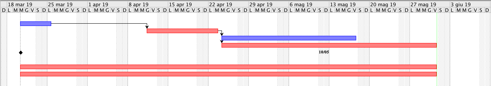
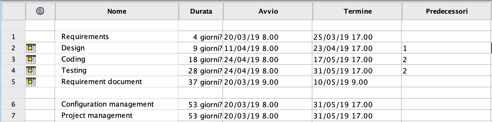

# Project Estimation  template

Authors: Antonio Santoro, Rinaldo Clemente, Marco Testa, Giovanni Camarda

Date: 31/05/2019

Version: 1.0

# Contents

- [Data from your LaTazza project](#data-from-your-latazza-project)

- [Estimate by product decomposition](#estimate-by-product-decomposition)
- [Estimate by activity decomposition ](#estimate-by-activity-decomposition)

# Data from your LaTazza project

###
|||
| ----------- | ------------------------------- | 
| Total person hours worked by your team, considering period March 5 to May 26, considering ALL activities (req, des, code, test,..)    | 266 |             
| Total Java LoC delivered on May 26 (only code, without Exceptions, no Junit code) | 4015 |
| Total number of Java classes delivered on May 26 (only code, no Junit code, no Exception classes)| 18 |
| Productivity P =| 60.37 |
| Average size of Java class A = | 223.05 |

# Estimate by product decomposition

### 

|             | Estimate                        |             
| ----------- | ------------------------------- |  
| Estimated n classes NC (no Exception classes)  | 13 |             
| Estimated LOC per class  (Here use Average A computed above )      | 223.05 | 
| Estimated LOC (= NC * A) | 2899.65 |
| Estimated effort  (person days) (Here use productivity P)  | 60.37 |      
| Estimated calendar time (calendar weeks) (Assume team of 4 people, 8 hours per day, 5 days per week ) | 8 |               

# Estimate by activity decomposition

### 

|         Activity name    | Estimated effort (days*hours)    |             
| ----------- | ------------------------------- | 
| Requirements| 384 |
| Design | 108|
| Coding | 2088 |
| Testing | 2856 |
| Configuration management | 424 |
| Project Management | 1325 |

###

# Gantt chart with activities

